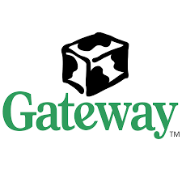
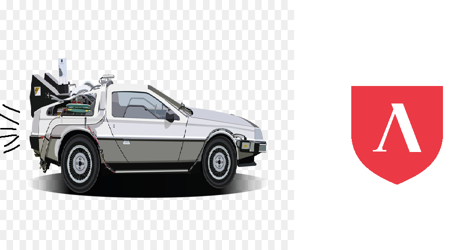

# <u>Why I want to join Lambda</u>


### A presentation slide show by Sha Adkins
##### https://boahs.info
###### source code : https://github.com/boahs/Lambda_School_Assignments/

###### Press space or enter to continue through out the slide show

---

##### 👋 Thanks for checking out my project 


###### Before continuing I'd just like to show my appreication for everyone who has reached out to make an introduction. I believe our journey will result in a long, hard and well earned victory. 

--- 

###### I've always been interested in technology since I was a child. I remember being really young always wanting to hop on a computer when I had the chance to. Luckily enough I had an aunt who lived down my street who had a Windows 95 desktop computer! 

<p class = "left">It came with...</align>  

* A state of the art floppy disc drive 
* 4MB of memory 
* A mouse & keyboard
* 70MEGABYTES of hard disk space

###### What more could you want in 1995? 

###### I would use her computer almost daily. She had a variety of games on floppydisc I could execute through MSdos! 

---

#### As time went on...

##### I ended up getting my first computer! It was the year 2000 when I had picked up a brand new gateway 2000 <u>millennium edition</u>!  


---

#### Fast forward 20 years...

###### 

--- 

#### Discovering Lambda...

##### After 10 months of self taught javascript I decided it was some for some structure, and where could I get this? A programming bootcamp! Doing my due diligence on which school offered the best curriculum for the money by some heavy search engine abuse I discovered LAMBDA!  

##### Not only did they have classes I was excited for but, they also included something that helps me tremendously! But of course I'm referring to the ISA agreement! You can't beat the offer - it's too good. So I thought "Lets take advantage of this, and give it our best! I've been self taught for a while. I'm ready to work with groups(new at this!) and ready to find a great paying job!

---

#### So we're here...

##### So now we're here. This is the last day of orientation, and offical class begins July 6th, 2020.  I'm more than excited to start the journey of being a proficient software developer, and to finally start a new chapter in my life. 

##### Cheers to programming!
## Cheers to Lambda!
# Cheers to <b>my colleagues!</b>

<p class = "size">End of presentation...press space to see tech stack I used, or click top left to restart</p>

--- 
``` Stack ```

``` Languages - Javascript, React, Markdown ```

``` Dependecies - Gatsby, react transition group, react, react-helmet, gatsby transformer sharp, gatsby remark images, gatsby plugin react helmet, gatsby plugin layout, gatsby plugin sharp, gatsby source filesystem, react swipeable, gatsby remark, react dom```

``` Built with love.```

``` Click 'boahs' in the top left to restart slide, or append /1 in the url```


